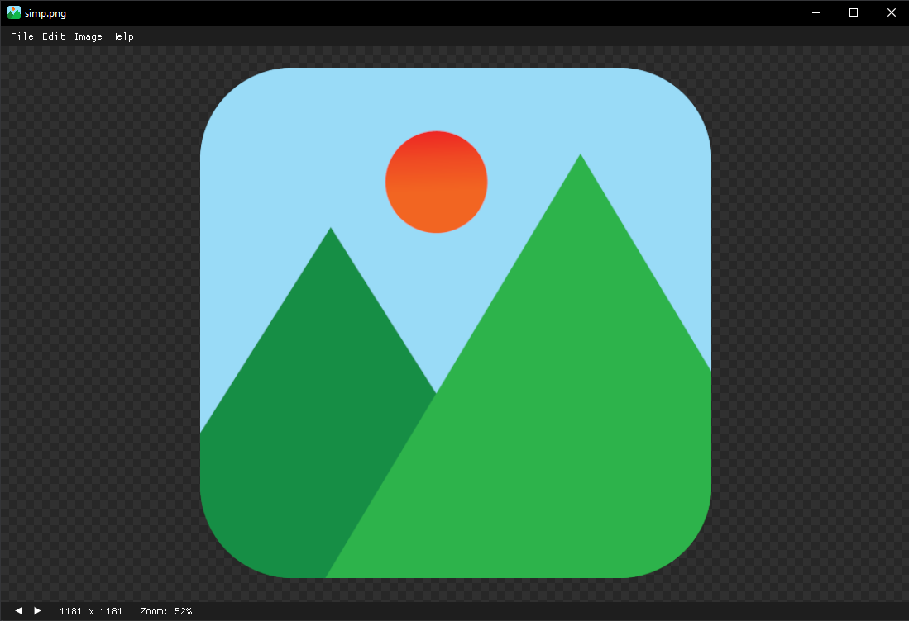

# Simp  

Simp is a fast and simple GPU-accelerated image manipulation program.



## Goals

* Support of as many image formats as possible.
* 60 Hz. Avoid blocking for more than 16ms.
* Flicker free redrawing.
* Smooth resizing.
* Always use GPU-acceleration where possible.
* Desktop OS support.
* Basic image manipulation.

### Non Goals

* Powerful image manipulation (I am not making the next photoshop)
* Web/Mobile platform support.

## Supported Platforms

| OS      | Support |
| ------- | :-----: |
| Windows |    ✅    |
| Linux   |    ✅    |
| MacOS   |    🆗    |

✅ = Tested and working  
🆗 = Untested but should work with minimal changes

## Supported Codecs

| Format    | Decoding                                                             | Encoding        |
| --------- | -------------------------------------------------------------------- | --------------- |
| PNG       | ✅                                                                    | ✅               |
| JPEG      | ✅ Baseline and progressive                                           | ✅ Baseline      |
| GIF       | ✅                                                                    | ✅               |
| BMP       | ✅                                                                    | ✅               |
| ICO       | ✅                                                                    | ✅               |
| TIFF      | ✅ Baseline(no fax support) + LZW + PackBits                          | ✅               |
| WebP      | ✅ Converted to Rgba8                                                 | ✅ Lossless only |
| AVIF      | ✅ Only 8-bit                                                         | ❌               |
| PNM       | ✅ PBM, PGM, PPM, standard PAM                                        | ❌               |
| DDS       | ✅ DXT1, DXT3, DXT5                                                   | ❌               |
| TGA       | ✅                                                                    | ✅               |
| farbfeld  | ✅                                                                    | ✅               |
| SVG       | ✅ Rastarized at 96 dpi (2)                                           | ❌               |
| PSD       | ✅                                                                    | ❌               |
| Raw       | ✅ Support from [rawloader](https://github.com/pedrocr/rawloader) (3) | ❌               |
| HEIF/HEIC | ❌ (4)                                                                | ❌               |
| EXR       | ❌                                                                    | ❌               |

1. Building with AVIF support requires the C library dav1d and is therefore not enabled by default.
2. SVGs are rastarized because Simp is primarly a bitmap image editor.
3. Most common cameras are supported but the colors may look weird because the standard curve may not fit all images.
4. HEIF/HEIC is not supported because it is currently very hard to link libheif on windows.

## Keybinds

| Action       | Input                |
| ------------ | :------------------- |
| Open image   | Ctrl + O             |
| Save as      | Ctrl + S             |
| Reload image | F5                   |
| New window   | Ctrl + N             |
| Undo         | Ctrl + Z             |
| Redo         | Ctrl + Y             |
| Copy         | Ctrl + C             |
| Paste        | Ctrl + V             |
| Resize       | Ctrl + R             |
| Rotate left  | Q                    |
| Rotate right | E                    |
| Zoom in      | - or Mousewheel up   |
| Zoom out     | + or Mousewheel down |
| Best fit     | B                    |
| Largest fit  | F                    |
| Crop         | Ctrl + X             |
| F11          | Fullscreen           |
| Delete image | Delete               |
| 1 - 9        | 100% - 900% Zoom     |

## System dependencies

System dependencies are only required at compile time.

### Linux
```shell
sudo apt-get install libgtk-3-dev libxcb-render0-dev libxcb-shape0-dev libxcb-xfixes0-dev libspeechd-dev libxkbcommon-dev libssl-dev
```

## Installation

### Cargo

```shell
cargo install simp
```

### Latest from github

```shell
cargo install --git https://github.com/Kl4rry/simp
```

The latest bulid is very likely buggy and unfinished.  
You can always also just grab the latest binary from actions build artifacts.

### Manual

Just download the exe from the releases tab. No actual installation is required.
